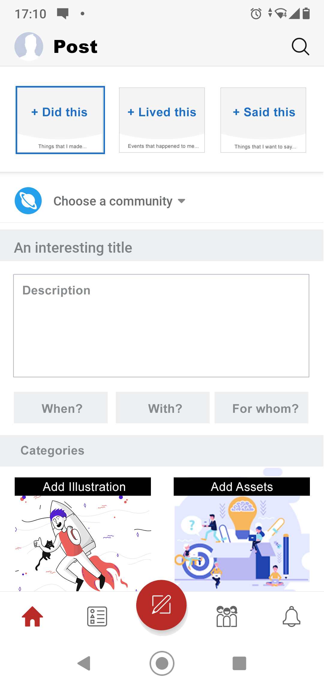
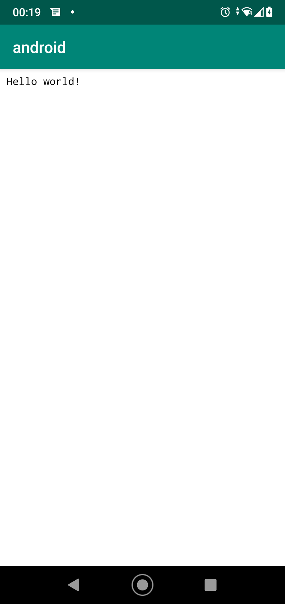

# Hyperfolio - Mobile (Android) App

Mobile app for the Hyperfolio (android). Webview based, built with Rust and Kotlin (it includes an Android Studio Export + Source Files). It uses the React frontend in mobile mode, exposed with a local server, run in a threaded webview launched by Kotlin. Rust is the main core and is uses the Actix web framework as a local server; Rust also uses as NDK and JNI bindings/libraries for communicating with the android device and layers to communicate with the Kolin main thread + the local server can communicate with the React app by REST calls, allowing for an offline + online experience with cached content if needed. The React app is served in the android assets directory as a webview, but it can also be embeded directly in the Rust server (the source files have a commented out section that initially embeded everything in a single build, but later I opted not bundling it all togheter).

This is a Proof-Of-Concept for integrating Rust in Android Apps.

Screenshots:

